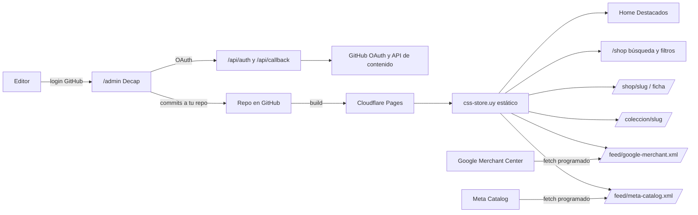

# CSS Store: productos, CMS y feeds

Vista general de cómo el contenido llega a la web y a Google / Meta.

## Flujo (una imagen)

## Qué hace cada pieza

| Dónde | Qué es |
|--------|--------|
| [public/admin/](/public/admin/) | UI de [Decap CMS](https://decapcms.org/); `index.html` carga el script; `config.yml` define back-end GitHub y las colecciones. |
| [functions/api/](/functions/api/) | [Cloudflare Pages Functions](https://developers.cloudflare.com/pages/functions/): `auth` y `callback` intercambian el `code` de GitHub por un `access_token` (solo OAuth, no toca el catálogo). |
| [src/content/products/](/src/content/products/), [src/content/collections/](/src/content/collections/), [src/content/data/siteSettings.json](/src/content/data/siteSettings.json) | Datos: productos (Markdown + imágenes), metadatos de “colecciones” (p. ej. Bob Esponja) y ajustes globales para los feeds. |
| [src/content.config.ts](/src/content.config.ts) | Esquemas [Content Collections](https://docs.astro.build/en/guides/content-collections/) de Astro (Zod + `image()`). |
| [src/lib/productFeed.ts](/src/lib/productFeed.ts) | Genera el XML RSS 2.0 con namespace de Google (`g:`) que comparten (con matices) **Google Merchant** y **Meta Catalog**. |
| [src/pages/feed/](/src/pages/feed/) | `google-merchant.xml` y `meta-catalog.xml` en build: URLs estáticas que Merchant / Commerce Manager pueden poner como URL de feed. |

## Flujos que importan a negocio

1. **Editor publica un producto**  
   Entra a `/admin`, edita, guarda. Decap hace commit/PR en el repo. Cloudflare Pages hace un nuevo build. La ficha, la tienda, el home (Destacados) y **ambos XML** se generan otra vez.

2. **Google / Meta actualizan el feed**  
   En Merchant Center y en Commerce Manager configurás la URL del feed (por ejemplo `https://css-store.uy/feed/google-merchant.xml`) y un **tiempo de actualización** (cada 24h, 12h, etc.). No hace falta un servidor tuyo corriendo: en cada fetch bajan el HTML/XML ya generado.

3. **Comprador entra por búsqueda o IA**  
   Las URLs `/shop/...` son HTML estático con **metadatos** y **JSON-LD** (Product, Offer, BreadcrumbList) además de la misma data que alimenta los feeds, para alinear ficha, schema y (donde aplica) políticas de Google.

## Cómo editar en local (opcional)

- Sitio: `npm run dev`.  
- CMS con backend local: en otra terminal, `npm run cms:local` (usa `local_backend: true` en `config.yml`). **No** se despliega: solo ahorra el login GitHub en el día a día.  

Detalle de OAuth, variables y Commerce/Merchant: [cms-setup.md](cms-setup.md).
